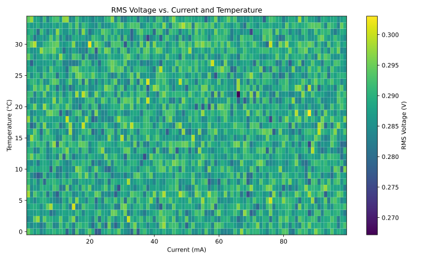

# LC120LaserNoise

This project characterizes the noise performance of diode lasers over drive current and temperature using the **LC120 Miniboard laser driver** and the **QL03 Photoreceiver**. A 200 MHz scope is used for the data acquisition system (DAQ). The analysis includes noise spectra across varying **laser drive currents** and **thermoelectric cooler (TEC) temperatures**, producing **2D plots** of integrated noise in current-temperature space. We've found that different diode lasers have **regions of instability** where the diode behaves irratically (mode hopping mostly).

---

## System Overview

The measurement setup includes:

- **LC120 Miniboard**: A compact, low noise, precision laser current driver with integrated TEC control.
- [**LP870 Nanosecond LED Pulser**](https://hobbs-eo.com/products/ns-digital-led-pulser): A high speed LED source used to characterize the photoreceiver.
- [**QL03 Photoreceiver**](https://hobbs-eo.com/products/ql03-photoreceiver): A large area, low-noise photodetector used to sense the optical output.
- [**Siglent SDS1202X-E Oscilloscope**](https://siglentna.com/product/sds1202x-e/): Acts as the DAQ, reading voltage traces from the QL03 output.

---

## Measurement Loop

The system operates by stepping through a grid of laser operating points:

1. **Loop over current and temperature**:
   - Set the LC120 laser current
   - Set the LC120 TEC temperature setpoint
2. **Acquire waveform** from the oscilloscope (connected to QL03)
3. **Process noise spectrum**:
   - Remove DC offset
   - Compute integrated noise
4. **Store and plot**:
   - Generate 2D plots of:
     - Integrated RMS noise vs. current and temperature
     - Slice plots (noise vs. temp, noise vs. current)

---

## Outputs

Since we're looking for **regions of instability** the main output are **2D color density maps** showing the noise for each Current - Temperature setting.

---

## Code Features

- Restartable runs (resumes from where data left off)
- Easily configurable CLI interface
- Supports swapping photodetectors (e.g., QL03 vs others)
- Uses **PyVISA** to control the scope and collect waveforms
